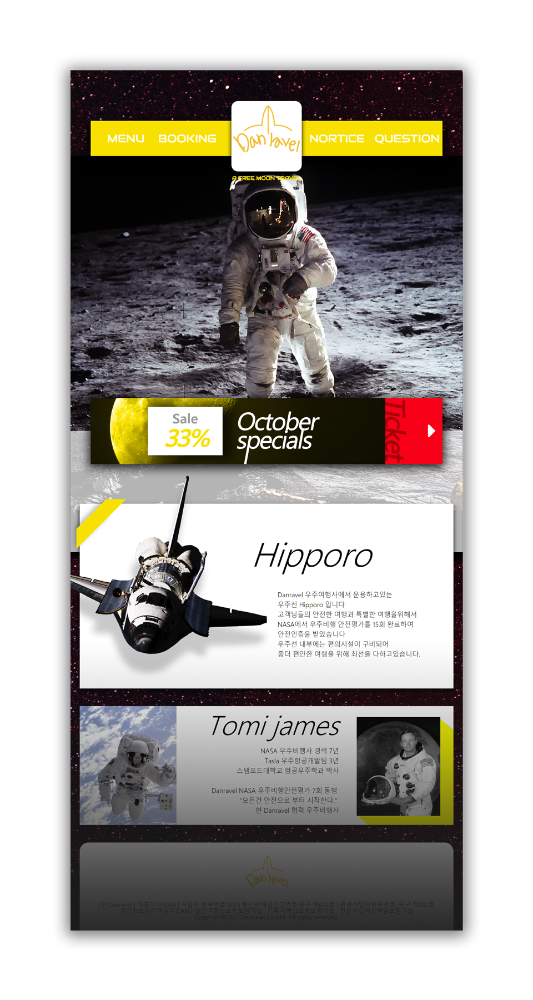

  

# portfolio-danravel

 

스타벅스 리디자인 | japan Starbucks webdesign remake

## Content

### 제작할 사이트 컨셉

여행 관련 애플리케이션 UX/UI 디자인을 하면서 애플리케이션이랑 연동할 수가 있는 기반 웹페이지를 만들었으면 좋겠다 생각했습니다. 미래에는 항공권 말고 우주여행이 활성화되면서 그에 따른 웹페이지도 필요할 거 같아 우주여행 콘셉트로 여행사 홈페이지를 제작해보았습니다.

### 사이트 제작을 하면서 알아두어야 할 것들

우주여행은 일생에 한번뿐일지도 모른다 여행초심자들이 걱정하는 부분들을 정리해서 보여준다.

### 기존 여행사 사이트의 문제점은 무엇인가?

방대한 양의 항공권, 호텔을 복잡적으로 묶어놔서 봐야할것을이 엄청많고 사용자가 감당하기 벅찬 내용을 보여줌으로서 보기힘든점이있다.

### 그 문제점을 어떤식으로 표현하여 보완할 것 인가?

이날의 추천 티켓 배너를바꿔서 원데이원티켓 컨셉으로 만들어보려한다.

### 기존 여행사웹 보다 새롭게 표현하고 싶은 부분은 무엇인가?

단촐하지만 하루에 한번씩들려서 볼만 이벤트성 페이지처럼 만들어 하루에 한번씩만 들려보게끔하는 라이트한 웹페이지로 표현하고싶다.

### 메인이 되는 카피라이트 문구는?

카피라이트말고 포토그래피로 달여행을 메인으로 달여행의 인증샷 같은 느낌으로 연출

### 컨텐츠는 무엇무엇을 담을 것인가?

안전을 생각하는 여행사라는 이미지를 주기위해

우주선, 우주선조종사의 소개로 진행하였다.

## 피드백, 보완점

[📎 Link](https://github.com/Hansanghyeon/portfolio-danravel/issues?q=is%3Aissue+sort%3Aupdated-desc+label%3AFeedBack+)

---

photo 출처

- https://pixabay.com/photo-60582/
- https://pixabay.com/photo-1090950/
- https://pixabay.com/photo-11051/
- https://pixabay.com/photo-582556/